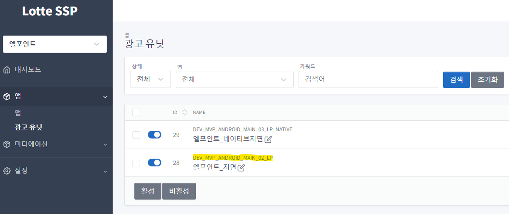

목차
===

- [Version History](#version-history)
- [시작하기 전에](#시작하기-전에)
    - [SDK 정보](#sdk-정보)
- [시작하기](#시작하기)
- [어플리케이션 설정](#어플리케이션-설정)
    - [Santa SDK 추가하기](#santa-sdk-추가하기)
    - [Google Library 추가하기](#google-library-추가하기)
    - [프로가드 설정](#프로가드-설정)
- [AndroidManifest 설정](#androidmanifest-설정)
    - [Permission 설정](#permission-설정)
    - [Android 9 Api Level 28+ 사용 설정 시 적용 사항](#android-9-api-level-28-사용-설정-시-적용-사항)
- [광고 적용하기](#광고-적용하기)
    - [배너 광고](#배너-광고)
    - [추가 설정 메소드](#추가-설정-메소드)

## Version History
- Version 1.2.1
    - 로그 업데이트
    - 광고 객체 해제 관련 업데이트
- Version 1.1.0
    - 화면 종료시, 이미지 다운로드 오류 케이스 수정 대응    
- Version 1.0.0

## 시작하기 전에
- Santa SDK에서는 광고 요청에 대한 응답 후 노출까지의 시간(노출 캐시 시간)을 10분 이내로 권장합니다 (IAB 권장). 광고 응답 이후 노출 시간 차이가 해당 시간보다 길어지면 광고 캠페인에 따라서 노출이 무효 처리될 수 있습니다.

### SDK 정보
- 참조 1: [Google Play 앱의 대상 API 수준 요구사항](https://support.google.com/googleplay/android-developer/answer/11926878?hl=ko)
- 참조 2: [Google Play의 대상 API 수준 요구사항 충족하기](https://developer.android.com/google/play/requirements/target-sdk?hl=ko)
  ```gradle
  minSdkVersion 23
  targetSdkVersion 33
  ```


## 시작하기
- 대시보드 세팅 관련 업데이트 예정

## 어플리케이션 설정

### Santa SDK 추가하기
- Android Studio
    - 프로젝트 수준의 build.gradle 파일에서 repositories 설정으로 maven 중앙 저장소를 추가합니다.
        ```gradle
        repositories {
            mavenCentral()
        }
        ```

    - 모듈의 앱 수준 build.gradle파일 (일반적으로 app/build.gradle)에 dependencies에 아래 항목을 추가합니다.
      ```gradle
      dependencies {
          implementation 'kr.motivi.santa:ads:1.2.1'
      }
      ```

### Google Library 추가하기
- Santa SDK 에 google의 광고 ID 를 활성화하려면 Google Play Servcies 라이브러리가 필요합니다. 광고 식별자 수집에 대한 Google Play 콘텐츠 가이드라인을 준수하기 위한 것입니다. build.gradle 파일의 dependencies 블럭에 다음과 같이 라이브러리를 추가해주세요.
    ```gradle
    dependencies {        
        implementation 'com.google.android.gms:play-services-ads-identifier:18.0.1'
    }
    ```

- 참조 : [Google Play 서비스 설정](https://developers.google.com/android/guides/setup?hl=ko)

### 프로가드 설정
- 앱 배포 시, 코드 축소/난독화/최적화를 하는 경우, 프로가드 규칙을 다음과 같이 적용합니다.
    ```gradle
    -keep class com.google.android.gms.ads.identifier.AdvertisingIdClient{public *;}
    -keep class com.google.android.gms.ads.identifier.AdvertisingIdClient$Info{public *;}
    
    -keep class kr.motivi.santa.network.data.** { *; }
    ```

## AndroidManifest 설정
- ~~``kr.motivi.santa.ads.MotiviActivity``를 AndroidManifest.xml의 application 태그 안에 추가합니다. 이 Activity는 전면광고를 표시하는데 사용됩니다.~~<br/>
    ```xml
    <!-- 전면 광고 시 필수 -->
    <activity
        android:name="kr.motivi.santa.ads.MotiviActivity">
    </activity>
    ```

### Permission 설정
- 필수권한
    ```xml
    <uses-permission android:name="android.permission.INTERNET" />
    <uses-permission android:name="android.permission.ACCESS_NETWORK_STATE" />
    
    <!-- 구글 정책(2022.03.21 업데이트 구글 문서)에 따라 대상 API 수준을 33(Android 13)로 업데이트하는 앱은 다음과 같이 매니페스트 파일에서 Google Play 서비스 일반 권한을 선언해야 합니다.-->
    <uses-permission android:name="com.google.android.gms.permission.AD_ID"/>
    ```

- 권장 권한
    ```xml
    <!-- 위치 정보 --> 
    <uses-permission android:name="android.permission.ACCESS_COARSE_LOCATION" />
    <uses-permission android:name="android.permission.ACCESS_FINE_LOCATION" />
    
    <!-- 와이파이 정보 -->
    <uses-permission android:name="android.permission.ACCESS_WIFI_STATE" />
    <uses-permission android:name="android.permission.CHANGE_WIFI_STATE" />
    ```

### Android 9 Api Level 28+ 사용 설정 시 적용 사항
- Api Level 28+ 부터 적용된 보안 정책
    - Android P를 대상으로 하는 앱이 암호화되지 않은 연결을 허용하지 않는 것을 기본으로 합니다.
    - http:// -> https:// 전환을 필요로 합니다.
    - santa sdk는 광고 요청 등의 Api에 https를 사용하지만 애드 서버에 연결된 많은 광고주 플랫폼사들의 광고 소재 리소스(image, js 등)의 원할한 활용을 위해 http 사용 허가 설정이 필요합니다.
    - 아래 두가지 방식중 하나로 적용 가능
        1. AndroidManifest.xml에 application 속성에
            android:usesCleartextTraffic="true" 직접 설정
            ```xml
            <application
                android:usesCleartextTraffic="true">
            ```

        2. res/xml 에 networkSecurityConfig 파일 구성 후, AndroidManifest.xml에 application 속성에
            android:networkSecurityConfig="@xml/network_security_config" 설정

            - res/xml/network_security_config.xml 파일
                ```xml
                <?xml version="1.0" encoding="utf-8"?>
                <network-security-config>
                    <base-config cleartextTrafficPermitted="true" />
                </network-security-config>
                ```
            - AndroidManifest.xml 파일
                ```xml
                <application
                    .
                    .
                    android:networkSecurityConfig="@xml/network_security_config">     
                ```

## 광고 적용하기

### 배너 광고
- [샘플 DemoActivity.java](https://github.com/motiv-i/SantaAndroidDemo/blob/main/app/src/main/java/com/motivi/santa/demo/DemoActivity.java)
- [샘플 demo_activity.xml](https://github.com/motiv-i/SantaAndroidDemo/blob/main/app/src/main/res/layout/demo_activity.xml)

1. 사이트로부터 발급받은 유닛 아이디를 확인합니다.
    - 

2.  배너 광고를 게재하려면 광고를 노출시킬 activity 혹은 fragment 레이아웃(XML 파일)에 SantaAdView를 적용합니다.

    1. Html 배너 설정시
        - 배너 타입 설정(app:ad_format)에서 "html"을 설정합니다. 동적설정은 [5-1. Html 타입만 설정하는 경우](#1-Html-타입만-설정하는-경우)가 여기에 해당합니다.
            ```xml
            <kr.motivi.santa.ads.view.SantaAdView
                android:id="@+id/adview"
                app:unit_id="3dbb5bee90c0ed1a7e82b7684d96986f469d403a"
                app:ad_format="html"                           
                android:layout_width="match_parent"
                android:layout_height="wrap_content">
            </kr.motivi.santa.ads.view.SantaAdView>
            ```

    2. Native 배너 설정시
        - 배너 타입 설정(app:ad_format)에서 "native"을 설정합니다. 동적설정은 [5-2. Native 타입만 설정한 경우](#2-Native-타입만-설정하는-경우)가 여기에 해당합니다.
            ```xml
            <kr.motivi.santa.ads.view.SantaAdView
                android:id="@+id/adview"
                app:unit_id="3dbb5bee90c0ed1a7e82b7684d96986f469d403a"
                app:ad_format="native"
                android:layout_width="match_parent"
                android:layout_height="wrap_content">
                <!-- Native 레이아웃 설정 -->
                <LinearLayout
                android:layout_width="match_parent"
                android:layout_height="wrap_content">
                    <LinearLayout
                        android:layout_width="match_parent"
                        android:layout_height="wrap_content">
                        <ImageView />
                        <TextView
                            android:id="@+id/native_title" />
                        <ImageView
                            android:id="@+id/native_privacy_information_icon_image" />
                    </LinearLayout>
                    <TextView
                        android:id="@+id/native_text" />
                    <ImageView
                        android:id="@+id/native_main_image"/>
                    </RelativeLayout>
            
                    <Button
                        android:id="@+id/native_cta"/>
                </LinearLayout>
            </kr.motivi.santa.ads.view.SantaAdView>
            ```
    1. ``app:unit_id`` : 1. 사이트에서 발급받은 유닛 아이디 설정합니다. 생략 후 동적으로 설정 가능합니다. (4. setAdUnitId().. 참고)
    2. ``app:ad_format`` : 해당 광고뷰에 적용할 광고 형식을 지정합니다. 생략 후 동적으로 설정 가능합니다. (5. setAdFormats().. 참조)

3. Activity에서 SantaAdView 인스턴스를 바인딩 합니다.
    ```java
    SantaAdView santaAdView = findViewById(R.id.adview);
    ``` 

4. ``setAdUnitId()`` 메서드를 사용하여 사이트로부터 발급받은  유닛아이디를 배너 인스턴스에 셋팅합니다. 레이아웃에 설정 후 생략 가능
    ```java
    santaAdView.setAdUnitId(String)
    ```

5. ``setAdFormats()`` 메서드를 사용하여 1개 이상의 광고 형식을 지정합니다. 레이아웃에 설정 후 생략 가능
    ```java
    /**
     * SantaAdView의 지원하는 광고 형식을 설정합니다.
    * @param adFormats 지원하는 광고 형식을 나타내는 AdFormat 배열입니다.
    *                  여러 개의 AdFormat 값을 받을 수 있습니다.
    *                  예시: setAdFormats(AdFormat.HTML, AdFormat.NATIVE);
    */
    public void setAdFormats(AdFormat... adFormats)
    ```
    - 하나의 배너 영역에 1개 이상의 타입을 지정할 수 있으며, 여러 타입을 지정한 경우에는 지정한 타입들 중 하나를 랜덤하게 응답 받습니다.

    1. Html 타입만 설정하는 경우

        - Html 타입의 배너 광고를 요청할 수 있습니다. SantaAdView에 Html 타입의 배너 광고가 노출됩니다.

            ``santaAdView.setAdFormats(AdFormat.HTML);``

    2. Native 타입만 설정하는 경우
        - Native 타입의 배너 광고를 요청할 수 있습니다. SantaAdView에 Native 타입의 배너 광고가 노출됩니다.

            ``santaAdView.setAdFormats(AdFormat.NATIVE);``

    3. Html 타입과 Native 타입 모두 설정하는 경우
        - Html과 Native, 2가지 타입의 광고를 요청할 수 있습니다. Html과 Native 둘 중 하나의 광고를 랜덤하게 응답 받고, 응답 받은 타입의 광고가 SantaAdView에 노출됩니다.

            ``santaAdView.setAdFormats(AdFormat.HTML, AdFormat.NATIVE);``

6. ``setOnAdListener()`` 메서드를 사용하여 광고 이벤트를 등록합니다.
    ```java
    santaAdView.setOnAdListener(new OnAdListener() {
        @Override
        public void onLoad() {}
        @Override
        public void onNoAd(NoAdCode noAdCode) {}
        @Override
        public void onShow() {}
        @Override
        public void onClick() {}
    });
    ```
    - ``onLoad()`` : 광고가 로딩된 시점에 호출 됩니다.
    - ``onShow()`` : 광고가 사용자에게 노출된 시점에 호출 됩니다.
    - ``onNoAd(NoAdCode)`` : 서버로부터 광고를 가져오지 못한 경우에 호출 됩니다.
    - ``onClick()`` : 광고 클릭 시 호출 됩니다.

7. Native 타입의 경우, 추가적인 설정이 필요합니다.
    1.	``setNativeViewBinder()`` 메서드를 사용하여, Native 광고가 노출될 영역을 설정한다.<br>NativeViewBinder는 2-2. Native 배너 설정시에서 xml에 선언한 id를 아래 각 함수를 통해 NativeViewBinder에 바인딩 합니다.
          ```java
          santaAdView.setNativeViewBinder(new NativeViewBinder.Builder()
          .mainImageId(R.id.native_main_image)
          .callToActionButtonId(R.id.native_cta)
          .titleTextViewId(R.id.native_title)
          .textTextViewId(R.id.native_text)
          .iconImageId(R.id.native_icon_image)
          .ratingBarId(R.id.native_rating)
          .adInfoImageId(R.id.native_privacy_information_icon_image)
          .build());
          ```
          - ``NativeViewBinder.Builder()`` : Native 광고가 노출 되어야 하는 View를 설정합니다.
          광고 요청 시 설정되는 항목으로는 제목, 상세설명, 메인이미지, 아이콘, 별점, 액션 버튼의 텍스트가 있으며,
          어플리케이션에서 사용할 항목만 NativeViewBinder에 설정하면 됩니다.
          - ``mainImageId(int resourceId)`` : 생성자에 설정한 View에 포함되어 있는 광고의 메인 이미지가 노출될 ImageView의 id를 설정합니다.
          - ``callToActionButtonId(int resourceId)`` : 생성자에 설정한 View에 포함되어 있는 광고의 ActionButton id를 설정합니다. 해당 Button에 텍스트가 설정 됩니다.
          - ``titleTextViewId(int resourceId)`` : 생성자에 설정한 View에 포함되어 있는 광고의 제목이 설정 될 TextView의 id를 설정합니다.
          - ``textTextViewId(int resourceId)`` : 생성자에 설정한 View에 포함되어 있는 광고의 설명이 설정 될 TextView의 id를 설정합니다.
          - ``iconImageId(int resourceId)`` : 생성자에 설정한 View에 포함되어 있는 광고의 아이콘이 노출될 ImageView의 id를 설정합니다.
          - ``ratingBarId(int resourceId)`` : 생성자에 설정한 View에 포함되어 있는 광고의 별점이 표시될 RatingBar의 id를 설정합니다.
          - ``adInfoImageId(int resourceId)`` : 생성자에 설정한 View에 포함되어 있는 광고 정보 표시 아이콘이 노출될 ImageView의 id를 설정합니다.
          해당 ImageView의 속성에 android:src를 설정하지 않아도 기본 Info 아이콘이 바인딩 됩니다.
          _**2017/07 방송통신위원회에서 시행되는 '온라인 맞춤형 광고 개인정보보호 가이드라인' 에 따라서 필수 적용 되어야 합니다.
          광고주측에서 제공하는 해당 광고의 타입(맞춤형 광고 여부)에 따라 정보 표시 아이콘(Opt-out)의 노출이 결정됩니다.
          ※ 광고 정보 표시 아이콘이 노출될 ImageView의 사이즈는 NxN(권장 20x20)으로 설정 되어야 합니다.**_
          - ``build();`` : 설정한 항목으로 NativeViewBinder객체를 생성합니다.

    2.	Native 광고 요청 시, 어플리케이션에서 필수로 요청할 항목들을 설정합니다.
        - 기본적으로 NativeViewBinder를 통해 설정된 asset항목들은 옵션으로 요청 되어지며, 아래 setRequiredAsset를 통해 지정될 경우 필수로 지정됩니다.
            ```java
            // Native 요청 시 필수로 존재해야 하는 값을 셋팅한다. 
            santaAdView.setRequiredAsset(NativeAsset.TITLE, NativeAsset.CTATEXT, NativeAsset.MAINIMAGE);
            ```  
        - ``TITLE`` : 제목
        - ``CTATEXT`` : 버튼에 표시될 텍스트
        - ``ICON`` : 아이콘
        - ``MAINIMAGE`` : 이미지
        - ``DESC`` : 상세설명
        - ``RATING`` : 별점

8. ``loadAd()`` 메서드를 사용하여 광고를 요청합니다.
    ```java
    santaAdView.loadAd()
    ```
9. Activity 종료 시 ``onDestroy``를 호출해야 합니다.
    ```java
    santaAdView.onDestroy()
    ```

### 추가 설정 메소드

- 필요에 따라 추가 설정 가능합니다.
    -	``setTestMode(boolean)`` : 광고의 UI 테스트를 위해 설정하는 값입니다. 통계에 적용 되지 않으며 항상 정해진 광고가 노출되게 됩니다.
    -	``setLocation(Location)`` : 위치 정보를 설정합니다. ([Android LocationManager](https://developer.android.com/reference/android/location/LocationManager)를 통해 얻은 위치 정보를 설정합니다). 좀 더 관련성 있는 광고가 노출 됩니다.
    -	``addKeyword(String, String)`` : Custom 메타 데이터(Key, Value)를 설정합니다.
    - ``setCoppa(boolean)`` : 미국 아동 온라인 사생활 보호법에 따라 13세 미만의 사용자를 설정하면 개인 정보를 제한하여 광고 입찰 처리됩니다. (IP, Device ID, Geo 정보등)
    -	``setRewarded(boolean)`` : 지면의 리워드 여부를 설정합니다.
